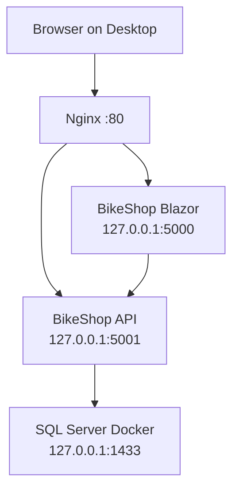

# Architecture: BikeShop на ThinkPad

BikeShop развёрнут как локальный сайт домашней сети. Сервер — ThinkPad с Ubuntu по адресу `192.168.1.102`.



## Вход для пользователя

Пользователь в домашней сети открывает:

```text
http://192.168.1.102
```

Только Nginx доступен с других устройств сети. API, Blazor и SQL Server слушают адрес `127.0.0.1`, поэтому доступны только программам на самом ThinkPad.

## Маршрутизация Nginx

| Путь браузера | Куда направляет Nginx |
|---|---|
| `/` и все обычные страницы | Blazor Server: `127.0.0.1:5000` |
| `/api/…` | BikeShop API: `127.0.0.1:5001` |
| `/_blazor` | Blazor SignalR/WebSocket endpoint: `127.0.0.1:5000` |

## Постоянные компоненты

| Компонент | Как работает | Где находятся важные данные |
|---|---|---|
| Nginx | systemd-служба `nginx` | `/etc/nginx/sites-available/bikeshop` |
| API | systemd-служба `bikeshop-api` | `/opt/bikeshop/api` и `/etc/bikeshop/api.env` |
| Blazor | systemd-служба `bikeshop-blazor` | `/opt/bikeshop/blazor` и `/etc/bikeshop/blazor.env` |
| SQL Server | Docker container `bikeshop-sql` | Docker volume `bikeshop-sql-data` |

API зависит от Docker, потому что SQL Server работает в Docker. Blazor зависит от API, потому что UI получает данные через API. Эти зависимости записаны в systemd unit-файлах.

## Безопасность текущего стенда

- приложения запускаются от отдельного пользователя Linux `bikeshop`, а не root;
- секреты находятся в `/etc/bikeshop/*.env` и не коммитятся;
- Data Protection keys доступны только `bikeshop` и root;
- SQL Server и API не опубликованы в LAN;
- сайт доступен только в домашней сети по HTTP.

Публичный интернет, домен, HTTPS, VPS и CI/CD в scope DeployLab не входят.

Подробное объяснение компонентов — в `DeploymentGuide.md`.
