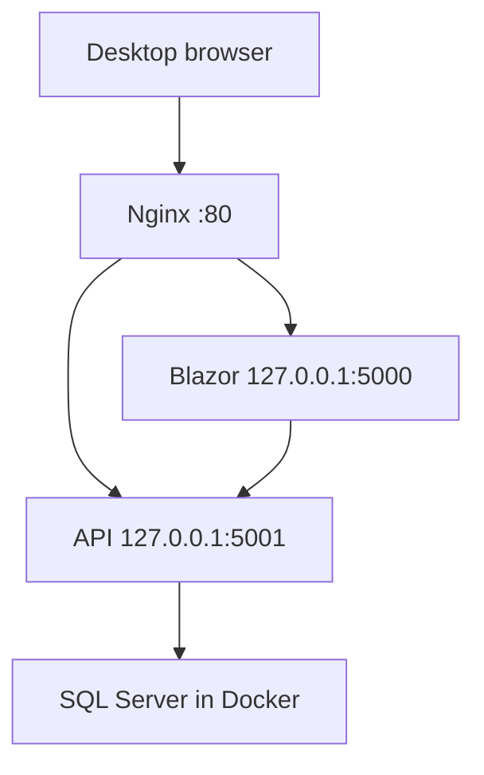

# Подробный учебник: публикация BikeShop в домашней сети

> Этот документ описывает фактическое локальное развёртывание BikeShop на ThinkPad с Ubuntu. Его цель — позволить повторить путь без чтения старых чатов, понять причины решений и объяснить их другому человеку.
>
> Для быстрого входа в курс дела сначала открой [Publishing.md](Publishing.md). Для пошагового обновления работающего сайта есть [UpdateRunbook.md](UpdateRunbook.md); подробный разбор обновления — [UpdateGuide.md](UpdateGuide.md).

## 1. Что мы построили

BikeShop состоит из двух ASP.NET Core приложений:

- **BikeShop.API** — API, бизнес-операции, Identity, EF Core и соединение с SQL Server;
- **BikeShop.Blazor** — пользовательский интерфейс Blazor Server. Он обращается к API по HTTP.

На домашнем сервере они не запускаются из терминала вручную. Ими управляет Linux `systemd`. Перед приложениями стоит Nginx — веб-сервер и обратный прокси.



**Текущее LAN-имя сервера:** `192.168.1.102`.

Открыть сайт с другого устройства домашней сети можно так:

```text
http://192.168.1.102
```

Это **не публичный интернет-сайт**. Домен, HTTPS, VPS и CI/CD не входят в DeployLab.

## 2. Зачем нужен каждый компонент

| Компонент | Роль |
|---|---|
| Ubuntu на ThinkPad | Операционная система сервера. Она запускает службы и хранит данные. |
| Docker | Запускает SQL Server в изолированном контейнере. |
| SQL Server | Хранит товары, пользователей, корзины, заказы и миграции BikeShop. |
| `bikeshop-api.service` | Запускает API как фоновую Linux-службу. |
| `bikeshop-blazor.service` | Запускает Blazor Server как фоновую Linux-службу. |
| Nginx | Принимает запросы браузера на порту 80 и направляет их в нужное приложение. |
| `systemd` | Следит за службами, запускает их при загрузке Linux и позволяет перезапускать их командами. |

### Почему нельзя дать API и Blazor внешний порт напрямую

API и Blazor слушают только `127.0.0.1`. Это адрес **самого сервера**, недоступный с Desktop по сети. Так сделано намеренно:

- внешний клиент видит один вход — Nginx на порту 80;
- API не торчит в домашнюю сеть отдельным портом;
- Nginx решает, куда направить `/` и `/api/`.

## 3. Фактическая конфигурация сервера

### Сеть и порты

| Что | Адрес |
|---|---|
| Nginx | `0.0.0.0:80` — доступен устройствам LAN |
| Blazor | `127.0.0.1:5000` — только на ThinkPad |
| API | `127.0.0.1:5001` — только на ThinkPad |
| SQL Server Docker | `127.0.0.1:1433` — только на ThinkPad |

### Постоянные данные и файлы

| Данные | Место | Почему это важно |
|---|---|---|
| База SQL Server | Docker volume `bikeshop-sql-data` | Удаление контейнера не удаляет БД, пока volume не удалён. |
| Контейнер БД | `bikeshop-sql` | Имеет policy `unless-stopped`, поэтому стартует после reboot. |
| API publish | `/opt/bikeshop/api` | Здесь находится `BikeShop.API.dll`. |
| Blazor publish | `/opt/bikeshop/blazor` | Здесь находится `BikeShop.Blazor.dll`, `wwwroot` и изображения. |
| Секреты | `/etc/bikeshop/*.env` | Не попадают в Git и не должны быть в publish-папках. |
| Data Protection API | `/opt/bikeshop/api/.aspnet/DataProtection-Keys` | Криптографические ключи приложения. |
| Data Protection Blazor | `/opt/bikeshop/blazor/.aspnet/DataProtection-Keys` | Криптографические ключи Blazor Server. |

## 4. Подготовка приложений на Desktop

### 4.1. Что означает publish

Исходный код — это `.cs`, `.razor`, `.csproj` и solution. Linux-серверу не нужны Visual Studio и весь исходный репозиторий для запуска. Команда `dotnet publish` создаёт готовую папку для запуска:

- собирает проект в Release;
- кладёт DLL приложения и зависимости;
- добавляет `appsettings*.json`, статические файлы и `wwwroot`;
- выбирает целевую платформу `linux-x64`.

BikeShop опубликован как **framework-dependent** приложение: на сервере должен быть установлен совместимый ASP.NET Core Runtime, а не полный SDK. Это нормально для сервера.

Пример публикации из корня репозитория BikeShop:

```bash
dotnet publish BikeShop.API/BikeShop.API.csproj \
  -c Release -r linux-x64 --self-contained false \
  -o ./publish/api

dotnet publish BikeShop.Blazor/BikeShop.Blazor.csproj \
  -c Release -r linux-x64 --self-contained false \
  -o ./publish/blazor
```

Команды создают две папки: `publish/api` и `publish/blazor`. Их содержимое, а не весь репозиторий, переносится на ThinkPad.

### 4.2. Конфигурация Blazor для deployed-режима

На Desktop BikeShop мог обращаться к API по dev-адресу. На ThinkPad API доступен Blazor-приложению по локальному адресу:

```text
http://127.0.0.1:5001
```

Это значение должно быть задано в конфигурации Blazor для Production до публикации. Именно это изменение было сохранено отдельным коммитом **Configure Blazor API endpoint**.

## 5. Первоначальная настройка Ubuntu

Ниже — смысл необходимых компонентов. Конкретные версии пакетов могут меняться; важен результат, а не копирование старого номера версии.

### 5.1. Нужные программы

На ThinkPad должны быть установлены:

- ASP.NET Core Runtime для целевой версии приложения (BikeShop сейчас `net8.0`);
- Docker Engine;
- Nginx;
- Git и SSH — для переноса/получения файлов, если они нужны в выбранном способе доставки.

Проверка runtime:

```bash
dotnet --list-runtimes
```

В списке должен быть `Microsoft.AspNetCore.App 8.x`.

Проверка Docker и Nginx:

```bash
docker --version
nginx -v
```

### 5.2. Отдельный системный пользователь

Приложения запускаются не от `root`, а от пользователя `bikeshop`. Это ограничивает последствия ошибки в приложении: оно имеет доступ только к выданным ему папкам.

Проверить пользователя можно так:

```bash
getent passwd bikeshop
```

Папки приложения принадлежат ему:

```text
/opt/bikeshop/api
/opt/bikeshop/blazor
```

## 6. SQL Server в Docker

Контейнер называется `bikeshop-sql`. Его restart policy:

```text
unless-stopped
```

Это означает: после перезагрузки Linux Docker запустит контейнер автоматически, если до этого контейнер не был сознательно остановлен командой `docker stop`.

Проверки:

```bash
sudo docker ps
sudo docker inspect -f '{{.HostConfig.RestartPolicy.Name}}' bikeshop-sql
systemctl is-enabled docker
```

Ожидаемый результат: контейнер виден в `docker ps`, policy — `unless-stopped`, Docker — `enabled`.

SQL Server опубликован только на loopback-интерфейсе:

```text
127.0.0.1:1433->1433/tcp
```

Значит, к нему могут подключаться приложения на ThinkPad, но не соседние устройства сети.

> Не удаляй volume `bikeshop-sql-data`, если хочешь сохранить базу. Команда `docker rm` удаляет контейнер, а `docker volume rm bikeshop-sql-data` удаляет сами данные БД — это разные вещи.

## 7. Секреты и переменные окружения

Пароли и connection strings не хранятся в Git. Они лежат в файлах:

```text
/etc/bikeshop/*.env
```

Systemd читает эти файлы через директиву `EnvironmentFile=` в unit-файлах. Такой подход отделяет:

- **код и publish** — их можно пересобирать и обновлять;
- **секреты сервера** — они остаются на сервере и не отправляются на GitHub.

Полезные проверки без вывода самих секретов:

```bash
sudo systemctl cat bikeshop-api
sudo systemctl cat bikeshop-blazor
```

В unit-файлах должны быть пути к `EnvironmentFile=`, но сами значения из `.env` не нужно отправлять в чат, коммитить или показывать в логах.

## 8. Systemd-службы

### 8.1. Что такое service unit

Файл `/etc/systemd/system/bikeshop-api.service` — инструкция Linux: какую программу запускать, от какого пользователя, в какой папке, с какими переменными и что делать при загрузке сервера.

У BikeShop два unit-файла:

```text
/etc/systemd/system/bikeshop-api.service
/etc/systemd/system/bikeshop-blazor.service
```

### 8.2. Фактические unit-файлы

#### API

```ini
[Unit]
Description=BikeShop API
After=network.target docker.service
Requires=docker.service

[Service]
WorkingDirectory=/opt/bikeshop/api
ExecStart=/usr/bin/dotnet /opt/bikeshop/api/BikeShop.API.dll
User=bikeshop
Group=bikeshop
EnvironmentFile=/etc/bikeshop/api.env
Restart=on-failure
RestartSec=5

[Install]
WantedBy=multi-user.target
```

#### Blazor Server

```ini
[Unit]
Description=BikeShop Blazor Server
After=network.target bikeshop-api.service
Requires=bikeshop-api.service

[Service]
WorkingDirectory=/opt/bikeshop/blazor
ExecStart=/usr/bin/dotnet /opt/bikeshop/blazor/BikeShop.Blazor.dll
User=bikeshop
Group=bikeshop
EnvironmentFile=/etc/bikeshop/blazor.env
Restart=on-failure
RestartSec=5

[Install]
WantedBy=multi-user.target
```

### 8.3. Как читать эти файлы

| Директива | Что она означает |
|---|---|
| `After=` | Порядок запуска: API стартует после сети и Docker, Blazor — после API. Сам по себе не делает зависимость обязательной. |
| `Requires=` | Обязательная зависимость: API требует Docker, а Blazor требует API. |
| `WorkingDirectory=` | Рабочая папка процесса; поэтому `.aspnet` оказалась рядом с publish. |
| `ExecStart=` | Точная команда запуска опубликованной DLL через `/usr/bin/dotnet`. |
| `User=` / `Group=` | Приложение не имеет прав root, а работает как `bikeshop`. |
| `EnvironmentFile=` | Подключает серверные секреты из `/etc/bikeshop/*.env`. |
| `Restart=on-failure` | При аварийном завершении systemd заново запустит процесс. Осознанный `systemctl stop` не перезапускается. |
| `RestartSec=5` | Пауза 5 секунд до автоматического перезапуска. |
| `WantedBy=multi-user.target` | Включает обычный автозапуск службы после загрузки Linux. |

Короткая формула:

```text
After    = «запусти меня позже».
Requires = «без этого компонента я не имею смысла».
```

Если unit-файл изменён, systemd нужно сообщить о нём:

```bash
sudo systemctl daemon-reload
sudo systemctl restart bikeshop-api bikeshop-blazor
```

Статус обеих служб должен быть `enabled` и `active (running)`:

```bash
systemctl is-enabled bikeshop-api bikeshop-blazor
systemctl status bikeshop-api bikeshop-blazor --no-pager
```

### 8.4. Самые полезные команды systemd

| Задача | Команда |
|---|---|
| Запустить | `sudo systemctl start bikeshop-api` |
| Остановить | `sudo systemctl stop bikeshop-api` |
| Перезапустить | `sudo systemctl restart bikeshop-api` |
| Посмотреть статус | `systemctl status bikeshop-api --no-pager` |
| Включить запуск после reboot | `sudo systemctl enable bikeshop-api` |
| Выключить автозапуск | `sudo systemctl disable bikeshop-api` |
| Читать журнал | `sudo journalctl -u bikeshop-api -n 100 --no-pager` |
| Смотреть журнал в реальном времени | `sudo journalctl -u bikeshop-api -f` |

Для Blazor вместо `bikeshop-api` подставь `bikeshop-blazor`.

### 8.5. Что уже проверено

Проверка выполнена 4 сентября 2026 года:

- обе службы включены в autostart;
- Nginx включён в autostart;
- Docker включён в autostart;
- SQL-контейнер имеет `unless-stopped`;
- после полноценного `sudo reboot` автоматически поднялись все компоненты;
- сайт снова открылся с Desktop;
- после `sudo systemctl restart bikeshop-api` API начал слушать `127.0.0.1:5001`, а сайт продолжил работать.

## 9. Nginx: единая входная точка

Nginx слушает порт `80`. Его правило маршрутизации по смыслу такое:

```text
http://192.168.1.102/      → Blazor, 127.0.0.1:5000
http://192.168.1.102/api/  → API,    127.0.0.1:5001
```

Посмотреть активную конфигурацию и проверить её синтаксис:

```bash
sudo nginx -t
sudo systemctl status nginx --no-pager
```

После изменения конфигурации сначала всегда выполняй проверку, а потом reload:

```bash
sudo nginx -t && sudo systemctl reload nginx
```

`reload` применяет новую конфигурацию без обычной остановки сервера. Если `nginx -t` сообщает ошибку, reload делать не нужно.

### 9.1. Фактический конфигурационный файл

`/etc/nginx/sites-enabled/bikeshop` — символическая ссылка на `/etc/nginx/sites-available/bikeshop`. Это обычная схема Ubuntu: файл хранится в `sites-available`, а ссылка в `sites-enabled` включает его.

```nginx
server {
    listen 80;
    listen [::]:80;
    server_name _;
    client_max_body_size 20m;

    location /api/ {
        proxy_pass http://127.0.0.1:5001;
        proxy_http_version 1.1;
        proxy_set_header Host $host;
        proxy_set_header X-Real-IP $remote_addr;
        proxy_set_header X-Forwarded-For $proxy_add_x_forwarded_for;
        proxy_set_header X-Forwarded-Proto $scheme;
    }

    location /_blazor {
        proxy_pass http://127.0.0.1:5000;
        proxy_http_version 1.1;
        proxy_set_header Upgrade $http_upgrade;
        proxy_set_header Connection "Upgrade";
        proxy_set_header Host $host;
        proxy_set_header X-Real-IP $remote_addr;
        proxy_set_header X-Forwarded-For $proxy_add_x_forwarded_for;
        proxy_set_header X-Forwarded-Proto $scheme;
        proxy_buffering off;
    }

    location / {
        proxy_pass http://127.0.0.1:5000;
        proxy_http_version 1.1;
        proxy_set_header Host $host;
        proxy_set_header X-Real-IP $remote_addr;
        proxy_set_header X-Forwarded-For $proxy_add_x_forwarded_for;
        proxy_set_header X-Forwarded-Proto $scheme;
    }
}
```

### 9.2. Зачем нужны эти блоки и заголовки

| Строка или блок | Объяснение |
|---|---|
| `listen 80` / `listen [::]:80` | Принимать HTTP по IPv4 и IPv6. |
| `server_name _` | Обрабатывать запросы без доменного имени; для LAN-доступа по IP подходит. |
| `client_max_body_size 20m` | Разрешить запросы до 20 МБ, в том числе загрузку изображений в admin UI. |
| `location /api/` | Отправлять запросы API на `127.0.0.1:5001`. |
| `location /` | Отправлять страницы, CSS, JavaScript и изображения в Blazor на `127.0.0.1:5000`. |
| `location /_blazor` | Отдельно обслуживать SignalR endpoint Blazor Server. |
| `proxy_pass` | Пересылать запрос внутреннему приложению; LAN-клиент не подключается к нему напрямую. |
| `Host` | Передать приложению host, который использовал браузер. |
| `X-Real-IP`, `X-Forwarded-For` | Передать реальный IP клиента через reverse proxy. |
| `X-Forwarded-Proto` | Передать исходную схему запроса — сейчас `http`, в будущем мог бы быть `https`. |
| `Upgrade` и `Connection \"Upgrade\"` | Разрешить переход HTTP-соединения в WebSocket, необходимый Blazor Server. |
| `proxy_buffering off` | Не буферизовать сообщения SignalR, а отсылать их браузеру сразу. |

Блоки `/api/` и `/_blazor` более специфичны, чем общий `/`, поэтому имеют собственные правила.

## 10. Data Protection keys

ASP.NET Core хранит служебные криптографические ключи для защиты framework-данных: например, antiforgery-токенов и защищённых cookie. Это не база данных и не пароль SQL Server.

У текущей установки есть отдельные постоянные наборы ключей:

```text
/opt/bikeshop/api/.aspnet/DataProtection-Keys
/opt/bikeshop/blazor/.aspnet/DataProtection-Keys
```

Файлы ключей принадлежат `bikeshop` и имеют права `600` (`-rw-------`): прочитать их может только `bikeshop` и root. Проверка:

```bash
sudo ls -l /opt/bikeshop/api/.aspnet/DataProtection-Keys
sudo ls -l /opt/bikeshop/blazor/.aspnet/DataProtection-Keys
```

При первом создании ключа ASP.NET Core может предупредить, что XML не зашифрован дополнительным механизмом. Для этого локального учебного сервера права Linux достаточны; отдельное шифрование ключей сознательно не настраиваем.

**Очень важно:** не удаляй папки `.aspnet/DataProtection-Keys` при обновлении publish. Потеря ключей не уничтожит БД, но приложение создаст новые ключи, и ранее защищённые данные браузера могут стать недействительными.

## 11. Быстрая диагностика

### Сайт не открывается с Desktop

1. Убедись, что Desktop и ThinkPad в одной сети.
2. Открой `http://192.168.1.102`, не `https://`.
3. На ThinkPad проверь Nginx:

   ```bash
   systemctl status nginx --no-pager
   ```

4. Проверь Blazor:

   ```bash
   systemctl status bikeshop-blazor --no-pager
   ```

5. Проверь API:

   ```bash
   systemctl status bikeshop-api --no-pager
   ```

### Страница открывается, но каталог/корзина дают ошибку

Это обычно означает, что Nginx и Blazor живы, но API или SQL Server недоступны.

```bash
systemctl status bikeshop-api --no-pager
sudo docker ps
sudo journalctl -u bikeshop-api -n 100 --no-pager
```

### После изменения unit-файла служба использует старую конфигурацию

Systemd читает unit-файлы в память. После их изменения нужно выполнить:

```bash
sudo systemctl daemon-reload
sudo systemctl restart bikeshop-api
```

### Нужны последние сообщения приложения

```bash
sudo journalctl -u bikeshop-api -n 100 --no-pager
sudo journalctl -u bikeshop-blazor -n 100 --no-pager
```

## 12. Границы этого стенда

DeployLab намеренно не решает следующие задачи:

- публикация в публичный интернет;
- DNS и доменное имя;
- HTTPS и сертификаты;
- автоматический CI/CD pipeline;
- резервное копирование по расписанию;
- отказоустойчивый кластер.

Это не недостатки текущего результата. Это следующие отдельные темы, которые стоит изучать после уверенного понимания уже работающей локальной цепочки.

## 13. Итоговая проверка здоровья

Эта команда показывает ключевые компоненты разом:

```bash
systemctl status bikeshop-api bikeshop-blazor nginx --no-pager
sudo docker ps
```

Здоровая система выглядит так:

- три systemd-службы — `active (running)`;
- API слушает `127.0.0.1:5001`;
- Blazor слушает `127.0.0.1:5000`;
- контейнер `bikeshop-sql` имеет статус `Up`;
- сайт открывается на Desktop по `http://192.168.1.102`.
