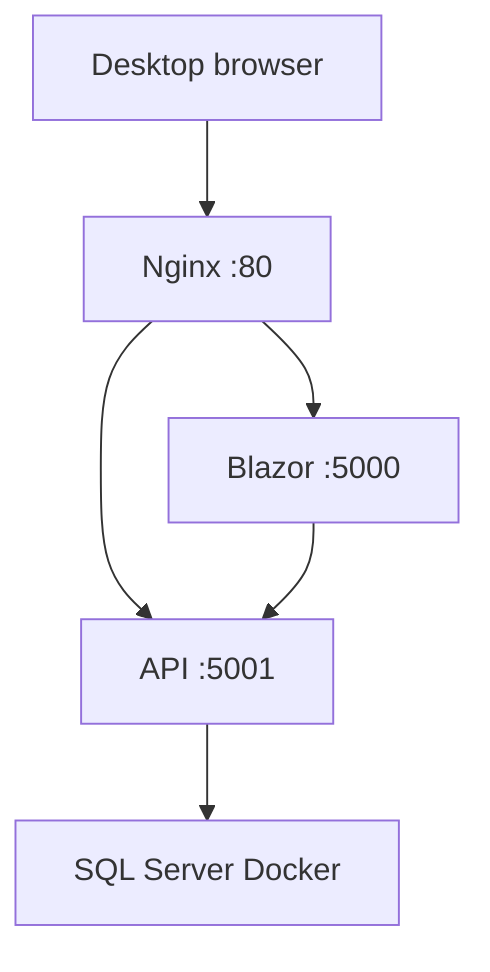

# BikeShop на ThinkPad: краткая схема публикации

Подробное объяснение всех шагов находится в [DeploymentGuide.md](DeploymentGuide.md). Этот файл нужен, когда надо быстро вспомнить устройство стенда.

## Текущая схема



- ThinkPad: `192.168.1.102`.
- Сайт в LAN: `http://192.168.1.102`.
- Blazor слушает только `127.0.0.1:5000`.
- API слушает только `127.0.0.1:5001`.
- SQL Server — контейнер `bikeshop-sql`, данные — volume `bikeshop-sql-data`.
- Nginx проксирует `/` в Blazor, `/api/` в API.
- Секреты лежат в `/etc/bikeshop/*.env`, не в Git.

## Где что лежит

| Что | Место |
|---|---|
| API | `/opt/bikeshop/api` |
| Blazor | `/opt/bikeshop/blazor` |
| systemd units | `/etc/systemd/system/bikeshop-*.service` |
| Secrets | `/etc/bikeshop/*.env` |
| API Data Protection keys | `/opt/bikeshop/api/.aspnet/DataProtection-Keys` |
| Blazor Data Protection keys | `/opt/bikeshop/blazor/.aspnet/DataProtection-Keys` |

## Проверка работоспособности

На ThinkPad:

```bash
systemctl status bikeshop-api bikeshop-blazor nginx --no-pager
sudo docker ps
```

Норма: все три службы имеют `active (running)`, а `bikeshop-sql` — статус `Up`.

После reboot всё поднимается автоматически: systemd-службы включены (`enabled`), Docker включён, а контейнер имеет policy `unless-stopped`.

## Главные правила

- Не запускай приложения вручную из SSH: ими управляет `systemd`.
- Не открывай API и SQL Server в LAN: доступ к ним нужен только Nginx/Blazor на самом ThinkPad.
- Не коммить секреты.
- Не удаляй Docker volume `bikeshop-sql-data`.
- Не удаляй целиком `/opt/bikeshop/api` и `/opt/bikeshop/blazor`: там хранятся Data Protection keys, а в Blazor могут быть пользовательские изображения.

## Полезные команды

```bash
sudo systemctl restart bikeshop-api
sudo systemctl restart bikeshop-blazor
sudo journalctl -u bikeshop-api -n 100 --no-pager
sudo journalctl -u bikeshop-blazor -n 100 --no-pager
sudo nginx -t && sudo systemctl reload nginx
```

Обновление приложения — по [UpdateRunbook.md](UpdateRunbook.md). Полное обучение и диагностика — по [DeploymentGuide.md](DeploymentGuide.md).
