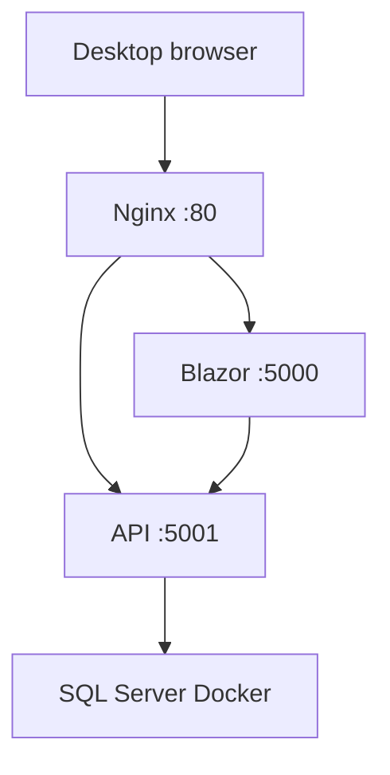

# Учебное повторение: как BikeShop оказался на ThinkPad

> Это не справочник и не аварийный runbook. Пройди его сверху вниз, чтобы ещё раз увидеть весь путь: от кода на Desktop до сайта в домашней сети.

## Что должно получиться в конце

На ThinkPad (`192.168.1.102`) работает сайт:

```text
http://192.168.1.102
```

Браузер попадает в Nginx. Nginx отдаёт обычные страницы Blazor-приложению и запросы `/api/...` — API. API хранит данные в SQL Server.



## Шаг 1. Выбрать, что вообще нужно запускать

В solution BikeShop несколько проектов, но отдельными программами являются только два:

- `BikeShop.API`;
- `BikeShop.Blazor`.

Остальные проекты — библиотеки. Они попадут в зависимости API или Blazor автоматически. Их отдельно на Linux не запускают.

**Проверка понимания:** на сервере должно быть два процесса `dotnet`, а не процесс для каждого проекта solution.

## Шаг 2. Собрать и опубликовать приложения на Desktop

Сначала код проверяется и собирается:

```bash
dotnet build BikeShop.sln -c Release
```

Затем для каждого запускаемого приложения создаётся publish-папка:

```bash
dotnet publish BikeShop.API/BikeShop.API.csproj \
  -c Release -r linux-x64 --self-contained false \
  -o ./publish/api

dotnet publish BikeShop.Blazor/BikeShop.Blazor.csproj \
  -c Release -r linux-x64 --self-contained false \
  -o ./publish/blazor
```

`build` отвечает на вопрос «компилируется ли код?». `publish` отвечает на вопрос «какие готовые файлы нужны серверу для запуска?». На сервер переносится publish, а не solution, исходники и Visual Studio.

`--self-contained false` означает: ThinkPad должен иметь ASP.NET Core Runtime 8, но полный SDK ему не нужен.

## Шаг 3. Проверить publish до переноса

Из каждой publish-папки можно запустить DLL через `dotnet`. В исходной проверке API слушал `5110`, а Blazor — `5120`:

```bash
dotnet BikeShop.API.dll --urls http://127.0.0.1:5110
dotnet BikeShop.Blazor.dll --urls http://127.0.0.1:5120
```

У API запрос к корню `/` возвращает `404` — это не ошибка deploy: маршрута `/` у API нет. У Blazor запрос к корню возвращает HTML и `200 OK`.

**Смысл шага:** сначала доказать, что publish работает сам по себе; только потом подозревать Linux, сеть или Nginx.

## Шаг 4. Подготовить ThinkPad как сервер

На Ubuntu нужны четыре вещи:

1. ASP.NET Core Runtime 8 — чтобы команда `dotnet BikeShop.API.dll` вообще могла запуститься.
2. Docker — чтобы запустить SQL Server без установки SQL Server прямо в ОС.
3. Nginx — чтобы дать браузерам один вход на порту 80.
4. systemd — он уже есть в Ubuntu и будет держать приложения запущенными.

Проверка runtime:

```bash
dotnet --list-runtimes
```

В выводе нужен `Microsoft.AspNetCore.App 8.x`.

## Шаг 5. Запустить постоянную базу данных

SQL Server работает в Docker-контейнере `bikeshop-sql`. Его данные вынесены в volume `bikeshop-sql-data`.

Это принципиально разные вещи:

```text
container = запущенная программа SQL Server
volume    = постоянные файлы базы
```

Контейнер имеет restart policy `unless-stopped`, а Docker включён в autostart. После reboot ThinkPad SQL Server поднимается сам.

Проверить:

```bash
sudo docker ps
sudo docker inspect -f '{{.HostConfig.RestartPolicy.Name}}' bikeshop-sql
```

## Шаг 6. Дать приложениям собственное место и права

Publish-папки находятся здесь:

```text
/opt/bikeshop/api
/opt/bikeshop/blazor
```

Приложения запускаются не как `root`, а как пользователь `bikeshop`. Поэтому он должен владеть этими папками.

```bash
sudo chown -R bikeshop:bikeshop /opt/bikeshop/api /opt/bikeshop/blazor
```

**Почему не root?** Ошибка в BikeShop тогда не получает автоматически права на весь сервер.

## Шаг 7. Отделить секреты от publish и Git

Пароль SQL Server, connection string и JWT secret не лежат в коде и publish-папках. Они хранятся на ThinkPad:

```text
/etc/bikeshop/api.env
/etc/bikeshop/blazor.env
```

Их читают systemd-службы. Поэтому можно обновить DLL приложения, не перенося и не публикуя секреты заново.

## Шаг 8. Научить systemd запускать два приложения

Systemd заменяет запуск вида `dotnet BikeShop.API.dll` в SSH-терминале. Он запускает процесс при загрузке Ubuntu, показывает его журнал и пытается поднять снова при падении.

Для API важная логика такая:

```text
Docker должен быть запущен → SQL Server доступен → можно запускать API.
```

Для Blazor:

```text
API должен быть запущен → Blazor может получать товары, корзину и заказы.
```

Поэтому `bikeshop-api.service` требует `docker.service`, а `bikeshop-blazor.service` требует `bikeshop-api.service`.

После создания или изменения unit-файлов:

```bash
sudo systemctl daemon-reload
sudo systemctl enable bikeshop-api bikeshop-blazor
sudo systemctl start bikeshop-api bikeshop-blazor
```

Проверка:

```bash
systemctl status bikeshop-api bikeshop-blazor --no-pager
```

Нужный результат — `active (running)`. API слушает `127.0.0.1:5001`, Blazor — `127.0.0.1:5000`.

## Шаг 9. Поставить Nginx перед приложениями

Браузер не должен знать о портах 5000 и 5001. Он обращается только к ThinkPad на порту 80:

```text
http://192.168.1.102
```

Nginx получает запрос и направляет его по пути:

```text
/api/...    → 127.0.0.1:5001  (API)
/_blazor    → 127.0.0.1:5000  (Blazor SignalR)
всё остальное → 127.0.0.1:5000 (Blazor страницы и файлы)
```

Для `/_blazor` нужны WebSocket-заголовки. Без них интерфейс может загрузить HTML, но перестать реагировать на клики: Blazor Server держит постоянное соединение между браузером и сервером.

После правки Nginx всегда сначала проверяется конфигурация:

```bash
sudo nginx -t && sudo systemctl reload nginx
```

## Шаг 10. Проверить всю цепочку с Desktop

Открой в браузере Desktop:

```text
http://192.168.1.102
```

Проверь каталог, корзину и admin login. Тем самым проверяется не один компонент, а вся цепочка:

```text
Browser → Nginx → Blazor → API → SQL Server
```

## Шаг 11. Проверить, что сервер переживает перезагрузку

Сайт, запущенный вручную, исчезнет при reboot. Поэтому была выполнена настоящая проверка:

```bash
sudo reboot
```

После загрузки были проверены:

```bash
systemctl status bikeshop-api bikeshop-blazor nginx --no-pager
sudo docker ps
```

Сайт снова открылся с Desktop. Это доказывает, что Docker, SQL Server, API, Blazor и Nginx настроены на автоматический запуск правильно.

## Шаг 12. Понять Data Protection keys

ASP.NET Core создаёт криптографические ключи для защищённых служебных данных, например antiforgery-токенов. Они не являются базой и не являются паролем SQL Server.

У BikeShop они уже постоянны:

```text
/opt/bikeshop/api/.aspnet/DataProtection-Keys
/opt/bikeshop/blazor/.aspnet/DataProtection-Keys
```

При обновлении приложения нельзя удалять эти папки. Иначе приложение создаст новые ключи, а старое защищённое состояние в браузере перестанет читаться.

## Одно предложение, которое связывает весь deploy

> Desktop превращает код в publish-файлы; ThinkPad хранит данные и запускает приложения; systemd держит их живыми; Nginx даёт браузеру единый вход; Docker изолирует SQL Server.

Когда этот путь повторится для Real-Time Chat, меняются имена приложений, порты и особенности чата, но не сама логика развёртывания.

Для точных конфигов, диагностики и обновления используй остальные документы:

- `Architecture.md` — итоговая схема;
- `Publishing.md` — детали build/publish;
- `DeploymentGuide.md` — полный справочник и реальные конфиги;
- `DeploymentRunbook.md` и `UpdateRunbook.md` — короткие рабочие действия;
- `Troubleshooting.md` — поиск неисправности.
